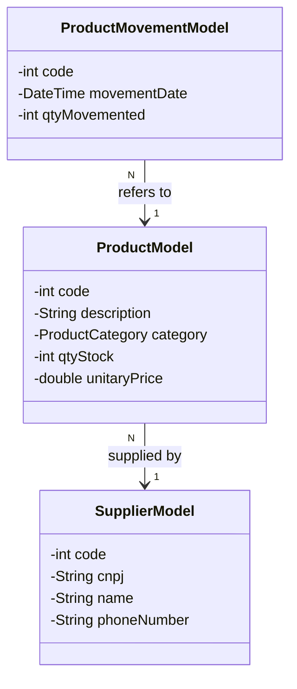
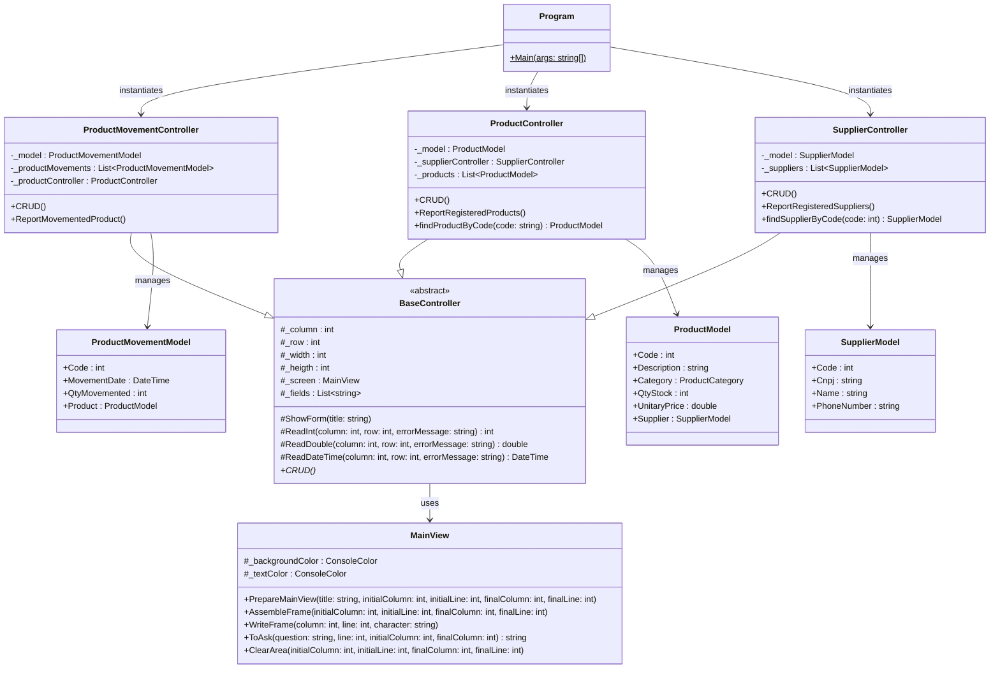

# Documentação Técnica: Sistema de Controle de Estoque StockShop

## 1. Documento de Requisitos do Produto (PRD)

* **Nome do Produto:** Sistema StockShop
* **Público-Alvo:** Lojistas, gerentes de estoque e administradores de comércios de pequeno porte.
* **Objetivo:** Fornecer uma interface de linha de comando (CLI) simples e eficiente para o gerenciamento de produtos, fornecedores e movimentações de estoque, permitindo operações de cadastro, consulta, alteração e exclusão (CRUD), além da geração de relatórios consolidados de controle.

**Visão Geral:** O sistema foi desenvolvido em C# utilizando princípios de Programação Orientada a Objetos (POO) e padrão arquitetural MVC. A interface interativa de console é desenhada com caracteres ASCII, apresentando cores personalizadas e controle de cursor. A persistência de dados é mantida inteiramente em memória por meio de estruturas estáticas durante a execução.

**Escopo:**
* Gerenciamento de Fornecedores (Cadastro, Consulta, Alteração e Exclusão com CNPJ único).
* Gerenciamento de Produtos (Cadastro vinculando Fornecedor, Preço, Categoria de 0 a 5 e Estoque).
* Registro de Movimentações de Estoque (Lançamentos de entrada e saída com controle automático de saldo físico).
* Relatórios Consolidados (Listagens tabulares estruturadas para produtos, fornecedores e movimentações).

---

## 2. Regras de Negócio

1. **Identificação Única:**
   * Produtos são identificados exclusivamente por um Código numérico.
   * Fornecedores são identificados por Código e por um CNPJ estruturado.
   * Movimentações de estoque possuem um Código de identificação exclusivo.
2. **Validação de Integridade:**
   * Não é permitido o cadastro de dois fornecedores com o mesmo CNPJ.
   * Não é permitido o cadastro de dois produtos com o mesmo Código.
   * Para registrar um produto, é obrigatório informar um fornecedor existente no sistema. Caso o fornecedor não exista, o fluxo disponibiliza a opção de cadastrá-lo imediatamente.
   * Para registrar uma movimentação de estoque, o produto selecionado deve estar cadastrado.
3. **Controle de Saldo de Estoque:**
   * Toda movimentação de produto deduz fisicamente a quantidade do estoque do produto.
   * O sistema impede movimentações cujo saldo resultante seja negativo, mostrando erro de estoque insuficiente e reiniciando a entrada.
   * Na exclusão de uma movimentação, a quantidade movimentada é estornada (somada de volta) ao estoque do produto.
   * Na alteração, o sistema devolve o estoque anterior temporariamente para validar o novo lançamento contra o estoque atualizado.
4. **Persistência:**
   * Os dados são mantidos em coleções estáticas em memória (Listas). Encerrando o aplicativo, os dados são resetados.

---

## 3. Requisitos Funcionais

| ID | Nome | Descrição |
| :--- | :--- | :--- |
| **RF01** | Gerenciar Produtos | Permite cadastrar, consultar, alterar e excluir produtos. Os dados incluem código, descrição, categoria (enum), preço, estoque e fornecedor. |
| **RF02** | Gerenciar Fornecedores | Permite cadastrar, consultar, alterar e excluir fornecedores. O CNPJ é validado contra duplicidade no sistema. |
| **RF03** | Registrar Movimentação | Registra movimentações vinculando código do produto, data e quantidade, validando e subtraindo a quantidade física do estoque. |
| **RF04** | Consultar Movimentação | Permite consultar lançamentos anteriores informando o código da movimentação. |
| **RF05** | Excluir Movimentação | Remove uma movimentação cadastrada e estorna a quantidade movimentada de volta ao estoque do produto correspondente. |
| **RF06** | Relatório de Produtos | Exibe tabela formatada com todos os produtos, categorias, preços, estoque atual e seus respectivos fornecedores. |
| **RF07** | Relatório de Fornecedores | Exibe tabela formatada com código, CNPJ, nome e telefone de todos os fornecedores. |
| **RF08** | Relatório de Movimentações | Exibe histórico de movimentações efetuadas no estoque. |
| **RF09** | Interface CLI Dinâmica | Apresenta menu interativo com molduras ASCII e tratamento resiliente para execução sem console físico. |

---

## 4. Casos de Uso

### UC01: Manter Produtos
* **Ator:** Usuário (Lojista)
* **Fluxo Principal:** O usuário seleciona 'Produtos', informa o Código do produto. Se o produto não existe, o sistema pergunta se deseja cadastrar. Solicita Descrição, Categoria (0 a 5), Quantidade e Preço, e o código do Fornecedor. Caso o fornecedor não exista, inicia o fluxo UC02 de cadastro de fornecedor. Se o produto já existe, exibe os dados atuais e oferece opções para alterar ou excluir.

### UC02: Manter Fornecedores
* **Ator:** Usuário (Lojista)
* **Fluxo Principal:** O usuário seleciona 'Fornecedores', informa o Código. Se não existe, solicita CNPJ, Nome e Telefone. O CNPJ é verificado contra duplicidade. Se existe, exibe os dados e permite A/E/V.

### UC03: Lançar Movimentação de Estoque
* **Ator:** Usuário (Lojista)
* **Fluxo Principal:** O usuário acessa 'Movimentações', informa o Código da movimentação. Se não existe, solicita Data, Quantidade Movimentada e Código do Produto. O sistema busca o produto por código. Se o produto não for encontrado, oferece opção para cadastrar novo produto, listar cadastrados ou cancelar a operação. Se encontrado, valida se há quantidade em estoque suficiente. Se sim, abate a quantidade do estoque do produto e grava a movimentação.

### UC04: Visualizar Relatórios
* **Ator:** Usuário (Lojista)
* **Fluxo Principal:** O usuário seleciona o relatório correspondente (Produtos, Fornecedores ou Movimentações). O sistema limpa a tela, monta o cabeçalho e renderiza a lista formatada de registros. Ao fim, solicita pressionar qualquer tecla para retornar ao menu principal.

---

## 5. Diagrama de Classes de Análise

O diagrama a seguir descreve as entidades conceituais do domínio e seus relacionamentos utilizando a notação Mermaid.



---

## 6. Diagrama de Classes de Projeto

O diagrama a seguir detalha as classes de controle, views e modelos que compõem a arquitetura do software.



---

## 7. Mocks de Tela (Plain Text)

### Tela Principal (Menu)
```text
╔══════════════════════════════════════════════════════════════════════════════╗
║                            Sistema StockShop                                 ║
║                                                                              ║
║   ╔══════════════════════════════════════════╗                               ║
║   ║ 1 - Cadastrar Produto                    ║                               ║
║   ║ 2 - Cadastrar Fornecedor                 ║                               ║
║   ║ 3 - Movimentações de Produto             ║                               ║
║   ║ 4 - Relatórios de Produtos Movimentados  ║                               ║
║   ║ 5 - Relatórios de Produtos Cadastrados   ║                               ║
║   ║ 6 - Relatórios de Fornecedores Cadastrados║                               ║
║   ║ 0 - Sair                                 ║                               ║
║   ║ Opção : _                                ║                               ║
║   ╚══════════════════════════════════════════╝                               ║
║                                                                              ║
║                                                                              ║
╚══════════════════════════════════════════════════════════════════════════════╝
```

### Tela de Cadastro de Produtos (CRUD)
```text
╔══════════════════════════════════════════════════════════════════════════════╗
║                            Cadastro de Produtos                              ║
║                                                                              ║
║   ╔══════════════════════════════════════════╗                               ║
║   ║ Código                 : 1               ║                               ║
║   ║ Descrição              : Lapis           ║                               ║
║   ║ (0-Escolar, 1-Escritório,                ║                               ║
║   ║  2-Presente, 3-Brinquedo,                ║                               ║
║   ║  4-Artesanato, 5-Papelaria)              ║                               ║
║   ║ Categoria              : 0               ║                               ║
║   ║ Quantidade em Estoque  : 10              ║                               ║
║   ║ Preço                  : R$2.50          ║                               ║
║   ║ Código do Fornecedor   : 1               ║                               ║
║   ╚══════════════════════════════════════════╝                               ║
║                                                                              ║
║   Confirma cadastro (S/N): _                                                 ║
╚══════════════════════════════════════════════════════════════════════════════╝
```

### Tela de Relatório (Produtos Cadastrados)
```text
╔══════════════════════════════════════════════════════════════════════════════╗
║                     Relatório de Produtos Cadastrados                        ║
║                                                                              ║
║  Código | Descrição           | Categoria     | Preço    | Estoque | Fornec. ║
║  --------------------------------------------------------------------------- ║
║  1      | Lapis               | Material_Esco | 2,50     | 10      | Art&Off ║
║                                                                              ║
║                                                                              ║
║  Pressione qualquer tecla para voltar ao menu...                             ║
╚══════════════════════════════════════════════════════════════════════════════╝
```
